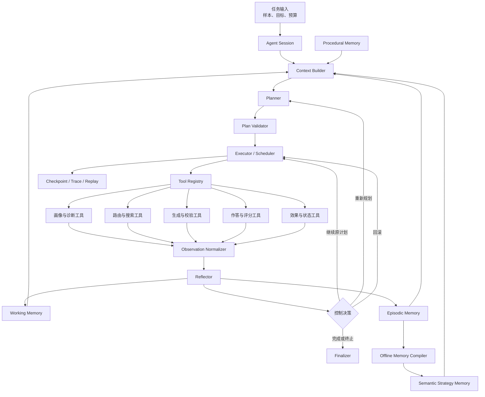
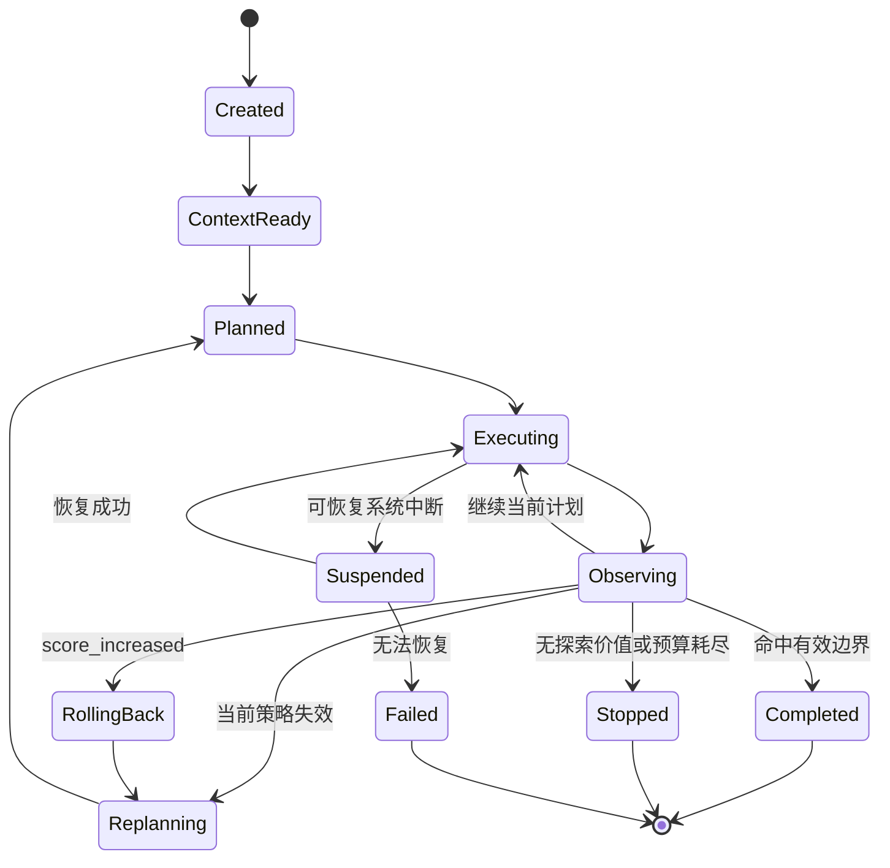

# Question Evolution Agent Harness 设计方案

## 1. 文档信息

- 方案日期：2026-08-04
- 方案状态：待评审
- 适用范围：Question Evolution 全流程的规划、记忆、工具调用、执行、后验反馈与治理
- 设计定位：领域专用、单 Agent 控制面的完整 Harness

本文只定义目标架构、组件职责、交互契约、状态流、治理边界和验收标准，不讨论具体代码修改方式。

## 2. 背景与设计目标

当前系统已经具备完整的问题进化业务链：稳定性探测、样本画像、候选筛选、算子路由、候选生成、复杂度校验、难度收益校验、候选选择、作答、Rubric 生成、评分、效果分析和状态更新。系统还具备局部多候选搜索、纵向算子叠加、局部 Memory、运行预算、实验产物、Checkpoint 和恢复能力。

现有系统的主要限制不是缺少业务阶段，而是缺少一个统一控制面来回答以下问题：

1. 当前样本的最终目标和本轮目标是什么；
2. 当前应采用何种搜索和算子策略；
3. 哪些工具可以调用，调用顺序和预算是什么；
4. 工具结果应如何转化为可重规划的观察；
5. 哪些历史经验应进入当前上下文；
6. 何时继续、回滚、换策略、停止或请求人工复核；
7. 如何保证全过程可恢复、可回放、可审计。

因此，本方案的目标是在现有 Question Evolution 领域流程之上建立一套受约束的 Agent Harness，使系统形成以下闭环：

```text
目标定义
-> 上下文构建
-> 计划生成
-> 计划校验
-> 工具执行
-> 结果观察
-> 后验反思
-> 状态与记忆更新
-> 继续、重规划、回滚或终止
```

## 3. 核心原则

### 3.1 真实评分是主要环境反馈

候选是否真正有效，优先由真实作答和评分结果判断。前置 Validator 只排除致命风险、提供分流信号和辅助排序，不能演化为过严的 candidate rejection system。

### 3.2 Agent 负责控制，不替代领域工具

Agent 负责目标、规划、工具选择、执行协调、观察和重规划。样本画像、算子路由、问题生成、校验、评分和状态更新仍由领域工具完成。

### 3.3 计划受约束而非完全自由

Agent 只能在冻结的工具集合、领域状态机、预算和策略规则内制定计划，不能任意跳过验证、评分或状态更新阶段。

### 3.4 业务失败与系统失败分离

`score_increased`、`not_applicable` 和 `no_gain` 属于业务结果；网络超时、产物损坏和 schema 不兼容属于系统故障。两类结果必须进入不同的恢复路径。

### 3.5 记忆分层且快照冻结

当前 Session 的工作记忆、实验内事实记忆、跨实验策略记忆和程序性规则必须分层管理。每次实验固定 Memory、Policy、Prompt 和 Operator 快照，运行中不得静默切换到最新版本。

### 3.6 自进化必须经过 Shadow 和验证

单次实验结果不能直接改变正式路由、Prompt、Validator、Judge 或全局 active Memory。所有优化建议先进入 `proposed` 或 `shadow`，再经回放、Holdout 或人工复核后发布。

## 4. 系统边界

### 4.1 系统包含

- Agent Session 生命周期；
- 结构化目标管理；
- Context Builder；
- Planner、Plan Validator 和 Replanner；
- Tool Registry 和工具契约；
- Executor、Scheduler 和 Recovery；
- Observation 标准化；
- Reflector 和停止决策；
- Working、Episodic、Semantic、Procedural 四层 Memory；
- Checkpoint、Trace、Replay 和审计；
- 离线 Global Judge 和策略发布生命周期；
- 权限、预算和人工审批机制。

### 4.2 系统不包含

- 通用开放域 Agent 平台；
- 无限深度树搜索；
- 由 LLM 任意执行 Shell 或写文件；
- 让 LLM 直接覆盖正式 Prompt 或评分规则；
- 用单次降分结果直接形成 active 全局策略；
- 在正式实验运行中热更新 Memory 或 Policy；
- 将完整实验历史全部注入 Planner 上下文；
- 首版多自治 Agent 协同。

## 5. 总体架构



总体架构分为两层：

1. Agent 控制层负责目标、计划、执行、观察、预算、恢复和审计；
2. Question Evolution 领域层负责画像、路由、生成、校验、评分和状态更新。

两层之间只通过标准工具契约、Observation 和 Artifact Reference 交互。

## 6. Agent Session 设计

每个根样本对应一个独立 Agent Session。Session 是目标管理、预算核算、故障恢复和审计追踪的最小单元。

### 6.1 Session 核心字段

| 字段 | 说明 |
| --- | --- |
| `session_id` | 本次 Agent 任务唯一标识 |
| `root_sample_id` | 根样本标识 |
| `goal` | 结构化任务目标 |
| `status` | 当前生命周期状态 |
| `round` | 当前进化轮次 |
| `plan_revision` | 当前计划版本 |
| `current_step_id` | 当前步骤 |
| `memory_snapshot_id` | 固定 Memory 快照 |
| `policy_snapshot_id` | 固定执行策略快照 |
| `prompt_snapshot_id` | 固定 Prompt 快照 |
| `operator_snapshot_id` | 固定算子注册表快照 |
| `budgets` | 调用、评估、分支和时间预算 |
| `observations` | 结构化观察引用 |
| `checkpoints` | 已确认恢复点 |
| `terminal_reason` | 最终停止原因 |

### 6.2 Session 状态机



### 6.3 终止状态

正式终止状态限定为：

- `effective_boundary_found`；
- `stable_low_score_stop`；
- `no_exploration_value`；
- `budget_exhausted`；
- `manual_review_required`；
- `system_failure`。

`score_increased` 不能作为成功终止状态，只能触发失败记忆、父节点恢复和重新规划。

## 7. 目标与效用设计

### 7.1 一级目标

系统一级目标固定为：

```text
在保持事实正确、可回答和题面自然的前提下，寻找能够稳定降低弱模型得分的推理边界。
```

### 7.2 优先级

目标按以下顺序约束：

1. 保持事实正确和可回答；
2. 形成真实得分下降；
3. 命中目标推理机制；
4. 避免题面泄漏和答案提示；
5. 保持语义经济性；
6. 控制模型调用与评估成本；
7. 保留有限探索空间。

### 7.3 硬约束

- 不可回答或外部知识陷阱不得进入正式评分主链；
- 不完整产物不得进入下一阶段；
- 超过硬预算后必须停止；
- 未经过真实评分的候选不得认定成功；
- `score_increased` 必须解释为负收益；
- 运行中的 Snapshot 不得变化；
- Planner 不得覆盖 hard risk、正式得分或发布门禁。

### 7.4 多维效用

候选价值保留多维指标，不压缩成不可解释的单一分数：

- `difficulty_gain`；
- `target_mechanism_hit`；
- `answerability`；
- `semantic_economy`；
- `exploration_value`；
- `surface_leak_risk`；
- `judge_instability`；
- `execution_cost`；
- `repeated_failure_penalty`。

候选排序可以使用透明权重，但正式结果必须同时保留原始维度。

## 8. Context Builder 设计

Context Builder 为 Planner 构造紧凑、可审计的决策上下文。

### 8.1 上下文组成

1. 样本事实：原题、参考材料、当前答案、Rubric、当前真实得分；
2. 样本画像：核心能力、题型结构、结论层级、虚高原因、目标边界；
3. 历史状态：已尝试算子、各轮效果、连续满分、失败模式、回滚状态；
4. Memory 检索：相似成功策略、失败模式、算子风险、适用条件和排除条件；
5. 工具能力：可用工具、eligible operators、搜索模式和策略限制；
6. 当前执行信息：剩余预算、已完成步骤、最近 Observation 和恢复点。

### 8.2 上下文压缩规则

- 只提供当前样本必要业务字段；
- 只保留最近若干轮状态摘要；
- 全局 Memory 只注入 Top-K 卡片摘要；
- 只展示当前具备执行资格的工具和算子；
- 原始长 Trace、完整历史答案和全量 Memory 不进入 Planner；
- 所有摘要必须保留原始 Artifact Reference，支持追溯。

## 9. Planner 设计

Planner 采用“固定业务骨架 + 动态局部计划”。固定骨架保证流程正确，动态计划负责探索策略。

### 9.1 三层计划

#### 任务计划

定义整个 Session：

- 是否值得进化；
- 最大轮次和总预算；
- 成功与停止标准；
- 允许使用的搜索模式；
- 人工复核门槛。

#### 轮次计划

定义当前轮次：

- 目标失败机制；
- 主算子、备选算子和规避算子；
- 单算子、多算子或纵向叠加；
- 候选数、分支数和 Exploration 预算；
- 校验和评分策略；
- 本轮停止条件。

#### 恢复计划

只在失败或异常后产生：

- 重试当前工具；
- 回滚父节点；
- 切换算子；
- 缩小搜索范围；
- 请求复评或人工复核；
- 安全终止。

### 9.2 Plan Step 契约

| 字段 | 说明 |
| --- | --- |
| `step_id` | 唯一步骤标识 |
| `intent` | 该步骤解决的问题 |
| `tool_name` | 注册工具名称 |
| `arguments` | 结构化工具参数 |
| `preconditions` | 执行前置条件 |
| `expected_outputs` | 预期正式产物 |
| `success_condition` | 成功判断条件 |
| `business_failure_action` | 业务失败处理 |
| `system_failure_action` | 系统故障处理 |
| `budget_limit` | 单步预算 |
| `depends_on` | 依赖步骤 |

### 9.3 Planner 权限边界

Planner 可以决定：

- 是否继续探索；
- 算子优先级；
- 搜索模式；
- 分支和候选预算；
- 是否保留一个 Exploration candidate；
- 失败后换算子、回滚还是停止；
- 是否进入下一轮。

Planner 不可以决定：

- 跳过真实评分；
- 改写 Judge 结果；
- 将无效候选认定成功；
- 取消 hard risk；
- 删除历史 Memory；
- 切换运行中快照；
- 直接发布全局策略。

### 9.4 Plan Validator

每个计划进入 Executor 前必须检查：

- 工具名称和版本是否合法；
- 参数是否符合契约；
- 前置 Artifact 是否存在且完整；
- 阶段依赖是否正确；
- 算子是否具备执行资格；
- 是否重复执行已确认失败的相同策略；
- 是否超过预算；
- 是否绕过校验、评分或状态更新；
- Snapshot 是否一致；
- 是否违反 `score_increased` 负收益语义。

## 10. 工具体系设计

Agent 只能通过 Tool Registry 访问领域能力，不直接访问底层文件、命令或模型服务。

### 10.1 工具分类

| 类型 | 职责 |
| --- | --- |
| 感知工具 | 稳定性探测、画像、虚高诊断 |
| 决策工具 | 候选筛选、算子路由、搜索规划 |
| 变换工具 | 问题进化、分支生成、纵向叠加 |
| 验证工具 | 可回答性、事实、难度收益、语义经济性 |
| 评估工具 | 作答、Rubric、评分、效果分析 |
| 状态工具 | 状态更新、回滚、局部 Memory 写入 |
| 审计工具 | Trace、成本、完整性和快照检查 |

### 10.2 工具契约

每个工具必须声明：

- 工具名称和版本；
- 输入和输出 Schema；
- 前置条件；
- 是否产生副作用；
- 幂等标识规则；
- 超时和重试策略；
- 可重试与不可重试错误；
- 成本估计；
- 正式产物要求；
- 输出的 Observation 类型。

### 10.3 原子工具与复合工具

原子工具只负责一个领域阶段，便于研究和异常恢复。复合工具封装稳定子流程，例如完整候选评分、多算子搜索、纵向叠加和父节点恢复。

常规运行优先选择复合工具，降低 Planner 调度复杂度；研究模式和异常恢复可以调用原子工具。Planner 不感知复合工具内部的低价值实现步骤。

## 11. Executor 与 Scheduler 设计

Executor 是确定性执行组件，不进行开放式推理。

### 11.1 标准执行循环

```text
读取当前步骤
-> 校验前置条件
-> 申请预算
-> 生成幂等调用标识
-> 调用注册工具
-> 校验工具结果和正式产物
-> 写入 Trace 与 Checkpoint
-> 生成 Observation
-> 交给 Reflector
-> 继续、重规划、回滚或停止
```

### 11.2 执行规则

- 每一步执行前锁定输入和 Snapshot；
- 每一步成功后立即建立可恢复 Checkpoint；
- 未发布完整正式产物不得进入下一阶段；
- 同一幂等标识不得重复消耗模型预算；
- 主决策路径和实验性评估路径必须分离；
- 恢复只能从已确认 Checkpoint 开始；
- 所有工具调用都必须产生 Trace 和预算记录。

### 11.3 并行调度

- 以根样本为公平调度单位；
- 单个样本不能长期占用全部并发；
- Main-chain candidate 优先于 Exploration candidate；
- Exploration 使用独立预算；
- hard risk 分支立即终止；
- 高成本、连续低价值分支允许提前停止；
- 并发完成顺序不能改变冻结的 Operator Plan；
- 每个 Candidate Group 最多选择一个 Exploration candidate。

## 12. Observation 与 Reflector 设计

### 12.1 Observation

所有工具结果统一转换为 Observation，Planner 和 Reflector 不直接适配各阶段原始格式。

Observation 至少包括：

- `observation_id`；
- `source_tool`；
- `type`；
- `severity`；
- `summary`；
- `evidence_refs`；
- `metrics`；
- `recommended_actions`；
- `requires_replan`；
- `requires_human_review`。

核心 Observation 类型包括：

```text
sample_profile_ready
route_selected
candidate_generated
candidate_invalid
difficulty_gain_uncertain
candidate_selected
score_decreased
score_unchanged
score_increased
effective_boundary_found
judge_instability_detected
budget_warning
tool_retryable_failure
tool_fatal_failure
rollback_completed
memory_written
```

### 12.2 Reflector

Reflector 采用“确定性规则优先、模型归因辅助”。规则层决定状态转移，模型层只补充复杂失败归因。

| Observation | 正式动作 |
| --- | --- |
| `effective_boundary_found` | 保存边界并完成 Session |
| `score_increased` | 写失败记忆、恢复父节点、重新规划 |
| `score_unchanged` | 切换算子或进行有限探索 |
| `candidate_invalid` | 终止当前分支 |
| `not_applicable` | 更换算子，不惩罚整个算子族 |
| `judge_instability_detected` | 暂停正式归因并触发复评 |
| `budget_warning` | 收缩后续搜索范围 |
| 硬预算耗尽 | 安全终止 |
| 正式产物不完整 | Fail-fast |

模型归因只回答：失败更可能来自 Router、Operator、题面生成、Validator、Rubric/Judge、样本本身还是搜索策略。模型归因不能直接改变正式得分和 hard state。

## 13. Memory 系统设计

### 13.1 L0 Working Memory

服务当前 Session，保存：

- 当前目标和计划；
- 最近 Observation；
- 当前分支和父节点；
- 剩余预算；
- 临时归因摘要。

Session 结束后归档，不直接作为全局策略使用。

### 13.2 L1 Episodic Memory

保存实验事实：

- 样本、轮次、节点和分支；
- 使用算子和生成候选；
- 验证结果和评分变化；
- 失败类型、成本和回滚；
- 终止状态。

Episodic Memory 回答“本次发生了什么”，并保留完整溯源。

### 13.3 L2 Semantic Strategy Memory

保存跨实验可迁移策略，主索引为：

```text
场景类型
× 题型结构
× 推理机制
× 虚高模式
× 推荐/备选/规避算子
```

策略卡必须包含：适用条件、排除条件、证据强度、有效率、负收益率、无效生成率、版本和状态。

### 13.4 L3 Procedural Memory

保存稳定执行规则：

- 工具调用顺序；
- 重试和 Fail-fast 规则；
- 预算规则；
- 回滚条件；
- 发布门禁；
- 人工审批条件。

Procedural Memory 必须版本化，不能由单次实验直接覆盖。

### 13.5 Memory 写入生命周期

局部事实满足幂等条件后可以立即追加。全局策略必须经过：

```text
局部事实
-> 跨样本归并
-> 风险过滤
-> 证据统计
-> 冲突检查
-> proposed
-> shadow
-> replay / holdout / 人工复核
-> active
```

### 13.6 Memory 检索

检索键包括：

- `scene_family`；
- `question_form`；
- `reasoning_mechanism`；
- `overscore_pattern`；
- `claim_level`；
- `operator_id`；
- `risk_labels`。

排序优先级依次为：推理机制、题型结构、排除条件、证据强度、虚高模式、场景、版本新鲜度、风险和冲突惩罚。

每个样本只注入少量 Top-K 策略摘要，完整证据只用于审计和 Global Judge。

## 14. 搜索策略设计

### 14.1 单算子搜索

适用于画像明确、目标机制清晰、主算子置信度高或预算较小的样本。

### 14.2 多算子横向搜索

适用于多个相邻算子都可能有效、Router 置信度不足或样本探索价值较高的情况。每个算子形成独立分支，同一 Candidate Group 最多保留一个 Exploration candidate。

### 14.3 纵向算子叠加

适用于单算子已经形成部分边界，但需要第二层推理压力的情况。只有父题可回答、第一层没有负收益且仍有明确未命中机制时才允许叠加。

纵向叠加必须限制深度和成本，不演化为无限树搜索。

## 15. 预算与停止设计

### 15.1 四级预算

| 级别 | 控制范围 |
| --- | --- |
| Session | 最大轮次、总模型调用、总评估和总时间 |
| Round | 最大分支、候选、Exploration 和复评次数 |
| Tool | 单次超时、最大重试、请求上限和并发 |
| Branch | 生成尝试、验证失败、评分次数和纵向深度 |

### 15.2 停止优先级

停止判断从高到低为：

1. 命中高可信有效边界；
2. 触发 hard risk；
3. 系统不可恢复故障；
4. 硬预算耗尽；
5. 当前搜索空间耗尽；
6. 样本无进一步探索价值；
7. 需要人工复核。

预算耗尽必须记录明确的 `terminal_reason`，不能表现为普通工具失败。

## 16. 错误与恢复设计

### 16.1 业务失败

包括 `score_increased`、`no_gain`、`not_applicable`、`invalid_complexity` 和 `repeated_pattern`。业务失败不进行同条件系统重试，而是更新 Memory、切换策略或终止分支。

### 16.2 可重试系统错误

包括网络超时、服务限流、模型服务临时不可用、临时解析失败和短暂锁冲突。采用有限次数重试、指数退避和受控备用服务。

### 16.3 不可重试系统错误

包括 Schema 不兼容、正式输入缺失、Artifact 哈希冲突、Memory Snapshot 缺失、Checkpoint 身份不匹配和配置冲突。此类错误必须 Fail-fast 或进入人工处理。

### 16.4 恢复规则

- 恢复使用原始输入、计划版本和所有原 Snapshot；
- 不重复执行已确认成功的幂等步骤；
- 不读取最新 Memory 替换原 Snapshot；
- 原环境无法恢复时明确失败；
- 恢复行为和降级行为必须写入 Trace；
- 正式 Operator Plan 存在时不得重新规划已冻结部分。

## 17. Global Judge 设计

Global Judge 是离线治理组件，不参与当前 Session 的正式实时决策。

### 17.1 输入

- 实验配置和 Snapshot；
- 样本、节点、分支和算子结果；
- 路由和校验记录；
- 前后得分、Judge 重复结果和一致性；
- 调用成本和耗时；
- 局部 Memory；
- 人工复核结果。

### 17.2 输出

- 失败层级诊断；
- 系统瓶颈统计；
- Optimization Proposal；
- Shadow 策略卡；
- 发布、降级或退役建议。

### 17.3 诊断层级

```text
sample/data
router
operator selection
operator generation
validation
rubric/judge
memory
search/cost
```

### 17.4 Proposal 生命周期

```text
proposed -> shadow -> active -> downgraded / retired
              |
              -> rejected
```

Global Judge 不得直接修改正式 Prompt、算子、Validator、Judge 或 active Memory。

## 18. 可观测性与审计

每个 Session 必须产生：

- Session Manifest；
- 任务目标和成功标准；
- 每个 Plan Revision；
- 每次 Tool Call 和 Tool Result；
- Observation 时间线；
- Memory 检索摘要；
- 预算消耗；
- Checkpoint；
- 重规划和回滚原因；
- 最终结果和 Terminal Reason。

系统核心指标包括：

- 有效边界率；
- `score_increased` 率；
- 无效生成率；
- `selected_then_not_applicable` 率；
- Judge 分歧率；
- 每个有效边界的调用成本；
- 平均重规划次数；
- Checkpoint 恢复成功率；
- Memory 命中前后的收益差异；
- Exploration 的边际收益和机会成本。

## 19. 权限和发布治理

权限分为三级：

### 19.1 只读权限

- 读取输入样本；
- 读取固定快照；
- 检索 Memory；
- 查看历史实验。

### 19.2 实验写权限

- 写 Session 状态；
- 写实验 Artifact；
- 写局部 Memory；
- 写 Trace 和 Checkpoint。

### 19.3 发布权限

- 发布全局 Memory；
- 激活或退役策略；
- 发布 Prompt、Policy 和 Operator Snapshot；
- 执行正式回滚。

实时执行 Agent 不具备发布权限。发布必须通过独立门禁和审批记录。

## 20. 最终输出契约

每个根样本的最终结果至少包括：

- `final_status`；
- `best_question`；
- `best_candidate_id`；
- `parent_question`；
- `score_before`；
- `score_after`；
- `score_delta`；
- `target_mechanism`；
- `operator_path`；
- `validation_summary`；
- `judge_stability`；
- `cost_summary`；
- `memory_refs`；
- `terminal_reason`。

最终结果必须能从根样本追溯到计划、工具调用、候选、评分、效果分析和 Memory 记录。

## 21. 验证与验收标准

### 21.1 契约验证

- Plan、Tool、Observation、Session 和 Memory 均有稳定契约；
- 非法计划在执行前被拒绝；
- 工具输入输出和正式 Artifact 可验证；
- 历史字段保持兼容，不依赖临时顶层字段跨阶段传递。

### 21.2 执行验证

- 相同幂等标识不会重复消耗预算；
- 中断后能从最后确认 Checkpoint 恢复；
- 不完整正式输出不能进入下一阶段；
- 主链与 Exploration 预算隔离；
- 每组最多选择一个 Exploration candidate；
- 同一输入、计划和 Snapshot 可进行确定性回放。

### 21.3 语义验证

- `score_increased` 必然进入失败记忆、回滚和重规划；
- Validator 不替代真实评分；
- hard risk 覆盖 Exploration；
- 无真实得分证据的候选不能进入成功态；
- 全局 Memory 不因单次偶然降分进入 active；
- Global Judge 不改变当前实验的正式结果。

### 21.4 运行验收

Harness 达到可用状态时，应满足：

1. 每个根样本都有独立、可恢复的 Session；
2. Planner 只生成受约束的结构化计划；
3. 所有领域能力只能通过注册工具调用；
4. 业务失败、系统失败、策略阻塞和人工复核能够区分；
5. Memory、Prompt、Policy 和 Operator Snapshot 全程冻结；
6. 所有规划、执行、回滚、记忆和终止决策均可审计；
7. 系统仍以真实 score drop 为主要有效性判断；
8. Agent 化没有把项目变成更严格的 candidate rejection system。

## 22. 最终设计结论

Question Evolution Agent Harness 应采用领域专用单 Agent 架构。Agent 控制层负责目标、上下文、计划、工具选择、执行协调、反思、恢复和预算；现有 Question Evolution 流程作为受契约保护的领域工具；真实评分作为主要环境反馈；四层 Memory 提供短期状态、实验事实、跨实验策略和稳定执行规则；Global Judge 负责离线归因和受控策略治理。

系统的自治边界必须保持清晰：实时 Agent 可以规划和重规划，但不能覆盖真实评分、硬风险、Snapshot 和发布门禁；全局策略可以提供参考，但必须经过 Shadow、回放和验证后才能进入正式执行。
