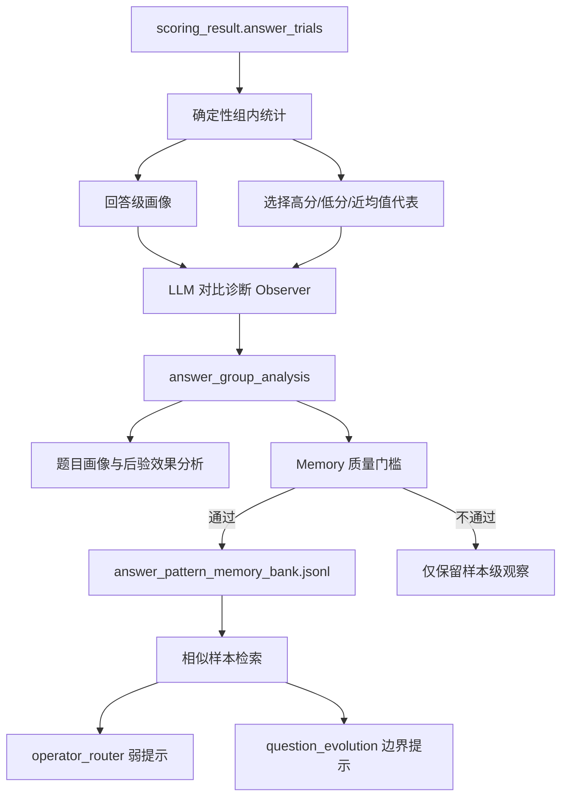

# 基于组内相对评分的多回答对比画像优化方案

- **文档版本**：v1.0
- **编写日期**：2026-07-26
- **方案状态**：待评审、待分阶段实施
- **适用项目**：Question Evolution Pipeline
- **方案定位**：借鉴 GRPO 的组内相对奖励思想，对同一道题的多次独立回答进行对比画像，并将经过验证的回答模式用于相似题型、相似场景的题目进化与后验分析。

## 0. 执行摘要

本方案具备较高可行性。当前项目已经完成多回答、多次评分、均值聚合、代表回答选择、样本画像和 operator/failure memory 等基础能力，新增工作的重点不是继续扩大回答与评分调用量，而是把现有 trial 数据从“用于求一个稳定均值”升级为“用于解释同一道题为什么会产生高分回答和低分回答”。

方案建议采用“确定性统计 + LLM 对比诊断 + 受控记忆复用”的三层结构：

```text
同题多个独立回答及逐项评分
→ 计算回答级均值、组内相对优势和 rubric 差异
→ 选择有代表性的高分、低分和近均值回答
→ 分析高低分差异及题目区分机制
→ 形成单样本回答组画像
→ 通过质量门槛后写入回答模式 memory
→ 在相似题型、相似场景中作为弱反馈复用
```

本方案一期优先服务于：

1. 识别模型在某类题上的稳定强项、薄弱点、取巧路径和易错边界；
2. 为 `profile_samples.py`、`operator_router.py` 和 `question_evolution.py` 提供更具体的进化依据；
3. 避免仅凭一份代表回答判断题目难度或 operator 效果；
4. 保持 Qwen 自评均值作为唯一在线决策分数，不让新分析直接成为前置拒绝规则。

本方案不等同于训练阶段的 GRPO：不计算策略梯度，不更新回答模型参数，不引入 PPO/GRPO loss。这里借鉴的仅是“同组样本使用相对基线进行比较”的思想，因此更准确的名称是：

> **同题组内相对评分驱动的多回答对比画像。**

## 1. 背景与问题定义

### 1.1 当前评分数据已经具备组内分析条件

当前默认评测协议中，每道题已经存在多份独立回答：

| 阶段 | 回答来源 | 回答 trial 数 | 每份回答评分次数 | 在线决策用途 |
| --- | --- | ---: | ---: | --- |
| Round 0 | Qwen | 3 | Qwen Judge 2 次 | 是 |
| Round 0 | GPT | 3 | GPT Judge 2 次 | 否，仅实验记录 |
| 进化后 | Qwen | 3 | Qwen Judge 2 次 | 是 |
| 进化后 | GPT | 3 | GPT Judge 2 次 | 否，仅实验记录 |
| 进化后 | Qwen | 3 | GPT Judge 2 次 | 否，仅实验记录 |

`scoring.py` 已经保存：

- 每个回答的 `candidate_answer`；
- 每个回答的 `qwen_score_mean`；
- 每次 judge repeat 的 `score_rate` 和 `item_scores`；
- 全组的 `qwen_score_summary`；
- 最接近全组均值的 `representative_trial_index`；
- GPT 回答、自评及 GPT 对 Qwen 回答的实验性结果。

`round0_stability_probe.py` 还会保存：

- `round0_score_trials`；
- `round0_score_summary`；
- `representative_round0_answer`；
- `rubric_item_stability`。

因此，一期不需要修改回答生成和评分协议，也不需要增加回答或 judge 调用，就能开展离线和 shadow 分析。

### 1.2 当前信息利用存在的缺口

当前多回答结果主要用于提高顶层分数稳定性，后续分析仍以代表回答为主：

```text
多回答、多评分
→ 聚合 score_rate
→ 选最接近均值的代表回答
→ profile/effect analysis 主要读取代表回答
```

这会损失四类重要信息：

1. **回答间差异**：同一道题为什么有的回答得分高、有的回答得分低；
2. **rubric 差异**：哪些评分项是稳定命中、稳定遗漏或只在部分回答中命中；
3. **题目区分机制**：高低分差异来自真实能力边界、题目歧义、rubric 不稳定，还是 judge 波动；
4. **可迁移模式**：某类题中反复出现的取巧路径、推理断点和有效边界尚未形成专门 memory。

### 1.3 需要解决的核心问题

本方案需要回答五个问题：

1. 如何把 judge 波动与回答质量差异分开；
2. 如何定义“高于组内平均”和“低于组内平均”，避免机械二分；
3. 如何从高低分回答中提取可验证的原因，而不是生成泛化套话；
4. 如何把单题观察沉淀为可跨样本复用的模式，同时避免 memory 污染；
5. 如何让新信号帮助题目进化，但不把系统改造成新的前置拒绝器。

## 2. 方案目标与非目标

### 2.1 核心目标

#### 目标 A：回答级画像

对每个 Qwen 回答 trial 生成结构化画像：

- 回答级平均得分；
- 相对同题组均值的优势值；
- Judge 一致性；
- 各 rubric 项命中率；
- 主要优点、扣分点和推理缺口；
- 回答是否利用了题面捷径；
- 诊断置信度及证据位置。

#### 目标 B：同题组对比画像

聚合高分、低分和近均值回答，判断：

- 高分回答比低分回答多做对了什么；
- 低分回答在哪个推理节点开始偏离；
- 哪些错误在多个回答中重复；
- 题目是否具有真实区分度；
- 题目是否可能存在歧义、rubric 错位或 judge 不稳定；
- 下一轮进化最值得强化哪个能力边界。

#### 目标 C：跨样本复用

将可靠模式按题型、场景、能力和失败模式建立索引，在其他相似样本中用于：

- 提醒 router 某类稳定薄弱点；
- 指导 question evolution 深化真实能力边界；
- 避免继续制造已被模型稳定掌握的表层变化；
- 避免复用已证明无效或只会产生评分噪声的设计；
- 支持题目质量和 benchmark 区分度分析。

### 2.2 非目标

一期明确不做：

- 不训练或微调回答模型；
- 不实现 GRPO、PPO 或其他强化学习优化器；
- 不改变 Qwen 在线 `score_rate` 的计算口径；
- 不把 GPT 分数并入 Qwen 在线分数；
- 不让 Qwen Judge 评分 GPT 回答；
- 不因一次低分回答直接判定题目进化成功；
- 不因一次高分回答直接判定 operator 失败；
- 不把单样本观察直接升级为全局硬规则；
- 不引入 embedding 去重、向量数据库或复杂知识图谱；
- 不与 K×R 评分后晋级、完整树搜索或多层回溯同时实施。

## 3. 与 GRPO 思想的对应关系

设同一道题有 `n` 个独立 Qwen 回答。第 `i` 个回答由 Qwen Judge 重复评分 `m` 次，单次得分率为：

```text
s(i,j), i = 1...n, j = 1...m
```

先在回答内部聚合 Judge repeat：

```text
answer_score(i) = mean_j(s(i,j))
```

再计算同题组基线：

```text
group_mean = mean_i(answer_score(i))
```

回答的组内相对优势定义为：

```text
relative_advantage(i) = answer_score(i) - group_mean
```

这与 GRPO 的相对奖励思想有相似性，但用途不同：

| 项目 | GRPO 训练 | 本方案 |
| --- | --- | --- |
| 分组单位 | 同一 prompt 的多个输出 | 同一道题的多个独立回答 |
| 相对信号 | 组内相对 reward/advantage | 组内相对得分与 rubric 差异 |
| 主要用途 | 更新模型策略 | 解释回答差异和题目边界 |
| 是否反向传播 | 是 | 否 |
| 是否改变模型参数 | 是 | 否 |
| 是否直接控制流水线 | 训练目标会控制更新 | 一期只做观察，后续仅作弱路由信号 |

必须先对 Judge repeat 求回答级均值，再比较不同回答。不能把同一回答的多个 Judge repeat 当成多个独立回答，否则会把评分模型波动误判成回答能力差异。

## 4. 可行性分析

### 4.1 数据可行性：高

现有 `scoring_result.answer_trials` 已包含一期所需的主要数据。确定性统计不需要新增模型调用，旧数据只要保留完整 trial 明细即可离线回放。

### 4.2 架构可行性：高

建议新增独立 Observer 阶段：

```text
scoring.py
→ analyze_answer_group.py
→ analyze_evolution_effect.py
→ update_sample_state.py
```

Round 0 建议调整为：

```text
round0_stability_probe.py
→ analyze_answer_group.py
→ profile_samples.py
```

这样不会修改评分核心，也不会改变候选生成、validator、候选分流和效果标签的既有语义。

### 4.3 统计可行性：中高

3 个回答足以形成初步对比，但不适合做强统计结论。需要设置近均值缓冲区、Judge 波动过滤和 memory 质量门槛。必要时可在远期对高价值或高波动样本追加到 5 个回答，但不属于一期要求。

### 4.4 复用可行性：中高

现有 memory 已使用以下签名进行相似样本匹配：

```text
core_capability
claim_level
problem_shape
candidate_overscore_cause
```

回答模式可以沿用这一机制，并补充可选的：

```text
scene
sample_type
reasoning_granularity
target_failure_mode
rubric_dimension
answer_failure_pattern
```

但复用应采用“多条证据累积后提升权重”的方式，不能让单条分析立即全局生效。

### 4.5 成本可行性：高

一期确定性统计新增成本为 0 次回答调用和 0 次 Judge 调用。若每题增加一次组内对比分析 LLM 调用，则每个完成评分的样本增加 1 次 Observer 调用。与当前默认每个进化样本 24 次回答/评分调用相比，增量可控。

## 5. 三种落地方式比较

| 方案 | 内容 | 优点 | 缺点 | 结论 |
| --- | --- | --- | --- | --- |
| A. 纯统计画像 | 只计算均值、方差、相对优势和 rubric 命中差异 | 成本低、确定性强、易测试 | 难以解释语义层面的推理差异 | 可作为第一步，但不足以独立完成目标 |
| B. 统计 + LLM 对比诊断 + 受控 memory | 先用确定性统计选高低分回答，再由 Observer 输出结构化差异，可靠结果写入独立 memory | 信息完整、成本适中、符合现有架构 | 需要新增 schema、prompt、stage 和 memory 门槛 | **推荐** |
| C. 自适应多回答与在线搜索控制 | 根据组内方差自动扩展回答数，并直接影响 operator、候选晋级和搜索预算 | 研究能力最强 | 与 K×R、树搜索耦合，成本和归因复杂 | 远期选项，不应一期实施 |

推荐采用 B，并按“先 shadow、后受控生效”的顺序推进。

## 6. 推荐总体架构



架构上分为四个职责明确的单元：

1. **组内统计器**：只做确定性计算；
2. **对比诊断器**：解释高低分回答差异和题目区分机制；
3. **Memory 晋级器**：判断单样本观察是否值得跨样本复用；
4. **检索与消费器**：向画像、路由和题目进化提供有限、可审计的提示。

## 7. 组内统计设计

### 7.1 评分层级

需要严格区分三层数据：

```text
Judge repeat 层：测评分波动
Answer trial 层：测不同回答质量
Question group 层：测题目对回答模型的区分形态
```

### 7.2 回答级统计

每个 Qwen 回答至少计算：

```text
answer_score_mean
answer_score_std
answer_score_min
answer_score_max
judge_disagreement
relative_advantage
relative_class
```

其中：

```text
relative_advantage = answer_score_mean - group_score_mean
```

### 7.3 不采用机械均值二分

如果三个回答得分分别为 `0.79 / 0.80 / 0.81`，直接按均值划分会制造虚假的高低分差异。建议配置最小有效差值：

```text
relative_margin = max(
    ABSOLUTE_RELATIVE_MARGIN,
    judge_noise_margin
)
```

一期建议：

```text
ABSOLUTE_RELATIVE_MARGIN = 0.05
```

分类规则：

```text
relative_advantage >= relative_margin
→ above_group

relative_advantage <= -relative_margin
→ below_group

其他
→ near_group
```

阈值应配置化，并在小样本实验后校准，不应写死为不可调整的业务规则。

### 7.4 Rubric 项级统计

对每个 rubric 项 `k`，从同一回答的多个 Judge repeat 中计算：

```text
item_award_ratio(i,k)
= mean_j(awarded(i,j,k) / weight(k))
```

Rubric 项应优先按规范化标题对齐，标题缺失时才回退到稳定索引；`weight <= 0` 的项不得参与除法或难度归因，应单独记录为无权重观察项。

再生成：

```text
item_hit_rate
item_award_mean
item_award_std
item_relative_advantage
stable_hit
stable_miss
judge_disputed
```

这样可以区分：

- 所有回答都稳定命中的基础项；
- 所有回答都稳定遗漏的困难项；
- 只在高分回答中命中的区分项；
- 同一回答在不同 Judge repeat 中结论不一致的噪声项。

### 7.5 题目级统计分类

统计层可以输出以下观察标签，但不得直接作为 hard gate：

| 标签 | 典型特征 | 含义 |
| --- | --- | --- |
| `uniformly_easy` | 均值高、回答间方差低、rubric 基本全命中 | 题目对当前模型缺少区分度 |
| `uniformly_hard` | 均值低、回答间方差低、存在一致遗漏项 | 可能形成稳定能力边界，也可能过难 |
| `discriminative_boundary` | 回答间差异明显、Judge 内部一致、高低分差异可解释 | 值得重点分析和复用 |
| `judge_unstable` | 同一回答的多个 Judge repeat 差异较大 | 暂不做强归因 |
| `ambiguous_or_rubric_misaligned` | 回答差异与 rubric 差异无法形成一致解释 | 优先检查题目或 rubric |
| `insufficient_trials` | 有效回答或评分不足 | 不写入跨样本 memory |

## 8. LLM 对比诊断设计

### 8.1 输入范围

Observer 可以读取：

- 当前题目；
- reference answer；
- rubric 和 score prompt；
- Qwen 多个回答文本；
- 每个回答的聚合分数和 rubric 项级统计；
- 现有 `sample_profile`、`overscore_diagnosis`；
- 统计层选出的最高分、最低分和近均值代表 trial。

Observer 不应读取：

- operator 的“期望成功结论”；
- 将某个候选标记为成功或失败的预设答案；
- 其他样本的原始回答全文；
- 会诱导它复述既有结论的强标签。

### 8.2 分析任务

Observer 按以下顺序分析：

1. 分别总结高分、低分和近均值回答的有效内容；
2. 将扣分点绑定到具体 rubric 项；
3. 比较高分回答比低分回答多完成了哪一步推理或证据约束；
4. 判断差异属于知识缺失、证据遗漏、条件误用、推理跳步、结论越界、表层取巧或表达不完整；
5. 判断该差异是否由题目歧义、reference/rubric 错位或 Judge 不一致造成；
6. 输出可复用的题目设计启示，但不直接推荐硬拒绝；
7. 为每条结论提供 trial、rubric item 或文本证据引用及置信度。

### 8.3 高分回答分析的用途

高分回答不能简单视为“正样本”。需要判断其高分原因：

- 是否真正完成了关键推理；
- 是否利用题干中的显式答案线索；
- 是否通过泛化模板覆盖 rubric；
- 是否依赖 reference/rubric 中过宽的给分条件；
- 是否说明当前题目只增加了表层复杂度；
- 哪些能力维度已经被模型稳定掌握，不值得继续重复施压。

高分模式主要用于：

```text
识别取巧路径
→ 下一轮减少答案泄漏和显式脚手架

识别稳定强项
→ 避免重复使用无效表层变化
```

### 8.4 低分回答分析的用途

低分回答同样不能直接视为“有效边界”。需要确认：

- 扣分是否集中在同一能力轴；
- 多个低分回答是否出现相同错误；
- Judge repeat 是否一致；
- 题目和 rubric 是否可回答、无明显错位；
- 低分是否来自格式、长度、事实缺失或解析问题；
- 错误方向是否与期望评估焦点一致。

只有满足上述条件，低分模式才可作为后续进化的边界提示。

### 8.5 对比优先于独立总结

一期不建议分别调用模型分析每个回答。推荐一次组内调用完成：

```text
高分代表回答
+ 低分代表回答
+ 可选近均值回答
+ rubric 项级差异
→ 一次结构化对比分析
```

这样能减少成本，也能避免三个独立分析生成互不一致的标签。

## 9. 推荐数据结构

### 9.1 样本级 `answer_group_analysis`

建议作为可选顶层字段附加在评分后产物中。完整分析只在当前阶段产物中使用；需要跨阶段消费的精简提示写入 `meta_info.question_evolution_metadata.answer_pattern_guidance`。

```json
{
  "answer_group_analysis": {
    "analysis_version": "answer_group_analysis_v1",
    "status": "completed",
    "score_source": "qwen_answer_qwen_judge",
    "answer_trial_count": 3,
    "judge_repeat_count": 2,
    "group_score_summary": {
      "mean": 0.71,
      "median": 0.72,
      "std": 0.13,
      "min": 0.55,
      "max": 0.86,
      "range": 0.31
    },
    "trial_profiles": [
      {
        "trial_index": 1,
        "answer_score_mean": 0.86,
        "judge_score_std": 0.01,
        "relative_advantage": 0.15,
        "relative_class": "above_group",
        "rubric_item_profile": [],
        "strength_patterns": [],
        "failure_patterns": [],
        "evidence_refs": []
      }
    ],
    "contrast_analysis": {
      "high_trial_index": 1,
      "low_trial_index": 3,
      "score_gap": 0.31,
      "decisive_rubric_items": [],
      "reasoning_differences": [],
      "shortcut_patterns": [],
      "recurring_failure_patterns": []
    },
    "question_diagnostic": {
      "difficulty_shape": "discriminative_boundary",
      "discriminative_axes": [],
      "ambiguity_risk": "low",
      "rubric_alignment_risk": "low",
      "judge_noise_risk": "low",
      "recommended_evolution_focus": [],
      "avoid_surface_patterns": []
    },
    "memory_eligibility": {
      "eligible": true,
      "confidence": "medium",
      "reasons": []
    }
  }
}
```

### 9.2 精简跨阶段提示

完整 trial 分析不应在所有阶段反复复制。建议只传递最多 3 条可操作提示：

```json
{
  "meta_info": {
    "question_evolution_metadata": {
      "answer_pattern_guidance": {
        "source_analysis_version": "answer_group_analysis_v1",
        "confirmed_failure_patterns": [],
        "confirmed_shortcut_patterns": [],
        "stable_strength_patterns": [],
        "recommended_boundary_focus": [],
        "confidence": "medium"
      }
    }
  }
}
```

### 9.3 回答模式 memory

建议新增：

```text
memory/answer_pattern_memory_bank.jsonl
```

每条记录代表一个样本对某个回答模式的证据事件，而不是直接维护可变的全局计数：

```json
{
  "memory_id": "...",
  "memory_idempotency_key": "...",
  "sample_id": "...",
  "root_sample_id": "...",
  "round": 1,
  "experiment_id": "...",
  "dataset_split": "train",
  "sample_signature": {
    "scene": "...",
    "sample_type": "...",
    "core_capability": "...",
    "claim_level": "...",
    "problem_shape": "...",
    "reasoning_granularity": "...",
    "candidate_overscore_cause": "..."
  },
  "pattern_type": "failure_pattern",
  "pattern_key": "...",
  "pattern_description": "...",
  "rubric_dimensions": [],
  "relative_score_gap": 0.18,
  "judge_noise_risk": "low",
  "analysis_confidence": "medium",
  "evidence_refs": [],
  "recommended_use": "target_as_boundary",
  "source_stage": "analyze_answer_group"
}
```

采用 append-only 证据事件可以保持历史不可变。读取时再按 `pattern_key + sample_signature` 聚合支持样本数、平均相对差和一致率。

## 10. Memory 晋级与复用规则

### 10.1 三层状态

回答模式建议采用三层可信度：

```text
observed
→ 单题观察，只保留在 answer_group_analysis

corroborated
→ 满足单题质量门槛，可写入 answer_pattern_memory_bank

actionable
→ 在多个不同样本中重复出现，才允许影响路由或生成提示
```

### 10.2 单题写入门槛

一期建议只有同时满足以下条件才写入 memory：

1. 有效 Qwen 回答 trial 数不少于 3；
2. 每个 Qwen 回答的必需 Judge repeat 完整；
3. Judge 波动风险不是 high；
4. 高低分代表回答差距达到配置阈值，建议初始为 `0.10`；
5. 差异能绑定到至少一个 rubric 项或明确文本证据；
6. 题目歧义和 rubric 错位风险不是 high；
7. LLM 分析置信度至少为 medium；
8. 不属于纯格式、长度、解析失败或外部知识陷阱；
9. `score_source` 必须是 Qwen 回答的 Qwen Judge 结果。

### 10.3 跨样本生效门槛

建议相同或高度相似模式至少在 2 个不同 `root_sample_id` 中出现，才进入 `actionable`。初期只做：

- `warn_only`；
- 提供 `recommended_boundary_focus`；
- 为候选生成 prompt 增加弱提示；
- 调整同分 operator 的次级排序。

初期不得：

- hard reject 候选；
- 全局禁用 operator；
- 覆盖已有 operator success/failure memory；
- 直接设置终止状态；
- 直接改写 `score_rate` 或 `effect_label`。

### 10.4 高分与低分模式的不同复用语义

| 来源 | 可能含义 | 推荐复用方式 |
| --- | --- | --- |
| 高分回答中的真实推理能力 | 当前模型已稳定掌握 | 避免继续重复相同表层难化 |
| 高分回答中的题面捷径 | 题目泄漏答案路径 | 下一轮减少显式脚手架或答案线索 |
| 低分回答中的稳定推理断点 | 真实能力边界候选 | 在相似题中强化相同能力轴，但保持可回答性 |
| 低分回答中的偶然遗漏 | 采样噪声 | 不写入 memory |
| 高低分差异来自 Judge | 评分不稳定 | 检查 rubric/Judge，不用于题目进化 |
| 高低分差异来自题目歧义 | 题目质量风险 | 进入人工复核，不作为有效边界 |

## 11. 与现有模块的集成设计

### 11.1 新增 `analyze_answer_group.py`

职责：

- 读取 `scoring_result.answer_trials` 或 `round0_score_trials`；
- 校验 Qwen/GPT 轨道；
- 计算回答级、rubric 项级和问题级统计；
- 选择对比 trial；
- 可选调用 LLM Observer；
- 写入 `answer_group_analysis`；
- 对旧数据和 trial 缺失数据输出明确 fallback 状态；
- 使用 evaluation/config hash 复用已经完成的分析，避免透传样本跨轮重复调用 Observer；
- 不修改任何原始评分字段。

### 11.2 `profile_samples.py`

Round 0 的画像 prompt 可以读取精简的 `answer_group_analysis`：

- 代表回答仍用于保持现有行为；
- 多回答差异作为补充证据；
- `sample_profile` 现有字段不删除、不重命名；
- 新诊断优先作为 `overscore_diagnosis` 的证据，不直接推荐 operator。

### 11.3 `analyze_evolution_effect.py`

保留前后 `score_rate` 比较逻辑，只增加可选观察：

- 进化前后 `difficulty_shape` 变化；
- 进化后是否出现稳定 failure pattern；
- 分数下降是否由真实回答差异而非 Judge 波动造成；
- `effective_boundary_probe` 的证据强度是否得到多回答支持。

新观察不得改变 `score_increased` 的负收益语义。

### 11.4 `update_sample_state.py`

继续作为 round-end memory 写入点：

- 根据 `memory_eligibility` 生成回答模式证据事件；
- 幂等追加到 `answer_pattern_memory_bank.jsonl`；
- 保持 operator/failure/invalid 三类现有 memory 不变；
- 回答模式不能伪装成 operator success memory。

Round 0 的回答组画像一期只服务于 `profile_samples.py`，默认不直接写在线 memory。若后续需要将 Round 0 模式纳入跨样本复用，应通过带 experiment/split 隔离的离线导入流程完成，避免分析阶段产生不可审计的即时副作用。

### 11.5 `operator_router.py`

后续受控生效阶段新增可选只读输入：

```text
--answer-pattern-memory
```

匹配时沿用现有签名相似度机制，但增加：

- 排除相同 `root_sample_id` 的直接自我复用；
- 按不同源样本数统计支持度；
- 只加载 `actionable` 或达到支持门槛的模式；
- 默认只生成 `memory_warnings` 和次级排序信号；
- 最多返回 3 条紧凑提示。

### 11.6 `question_evolution.py`

只消费 router 已筛选的紧凑提示：

```text
confirmed_failure_patterns
confirmed_shortcut_patterns
stable_strength_patterns
recommended_boundary_focus
```

Prompt 应要求模型：

- 深化真实判断边界；
- 避免已知取巧路径；
- 不复制历史回答文本；
- 不把失败模式直接写进题干；
- 不增加 A/B、层级、排序、双门槛等显式脚手架；
- 不引入题干外事实或不可回答约束。

### 11.7 编排脚本

建议新增开关：

```text
ENABLE_ANSWER_GROUP_ANALYSIS=true|false
ANSWER_GROUP_ANALYSIS_MODE=deterministic|llm_shadow|active
ANSWER_PATTERN_MEMORY_ENABLED=true|false
ANSWER_PATTERN_MIN_SCORE_GAP=0.10
ANSWER_PATTERN_MIN_SOURCE_SAMPLES=2
```

关闭所有开关后必须完全复现当前主流程。

## 12. 建议文件改动范围

### 12.1 新增文件

```text
analyze_answer_group.py
prompts/answer_group_analysis_prompt.py
schemas/answer_group_analysis.schema.json
schemas/answer_pattern_memory_entry.schema.json
tests/test_answer_group_analysis.py
tests/test_answer_pattern_memory.py
memory/answer_pattern_memory_bank.jsonl
```

### 12.2 可能修改的文件

```text
run_loop.sh
run_loop.ps1
profile_samples.py
analyze_evolution_effect.py
update_sample_state.py
operator_router.py
question_evolution.py
schemas/pipeline_record.schema.json
schemas/README.md
memory/README.md
check_runtime_environment.py
```

一期应优先保持修改增量化，不改动 `gen_rubric.py`、评分 prompt 和 `scoring.py` 的在线分数语义。

## 13. 分阶段实施路线

### 阶段 0：离线数据审计

目标：确认现有 trial 数据足以支持画像。

工作项：

1. 从少量 Round 0 和进化后产物读取回答 trial；
2. 统计有效回答数、Judge repeat 完整率和 item score 完整率；
3. 统计回答间方差与 Judge 内部方差；
4. 验证 Qwen、GPT 轨道不会混用；
5. 人工抽查高低分回答是否存在可解释差异。

验收：

- 至少 95% 正式完成评分的样本可解析出完整 Qwen trial；
- 能明确区分回答差异和 Judge 差异；
- 不修改任何流水线行为。

### 阶段 1：确定性回答组画像

目标：零新增模型调用形成稳定统计基线。

工作项：

1. 新增 `analyze_answer_group.py`；
2. 计算回答级均值、Judge 波动、组内优势和 rubric 项统计；
3. 输出题目级统计标签；
4. 增加 schema、manifest、checkpoint 和旧数据 fallback；
5. 生成离线统计报告。

验收：

- 不改变 `score_rate`、`scoring_result` 和代表 trial；
- 同一输入重复运行得到相同输出；
- trial 顺序变化不影响聚合结果；
- GPT 分数不参与 Qwen 组内优势；
- 无完整 trial 时输出 `insufficient_trials`，不伪造结论。

### 阶段 2：LLM 对比诊断 Shadow

目标：验证高低分语义差异是否稳定、具体、可行动。

工作项：

1. 新增结构化 prompt 和解析校验；
2. 每个样本最多一次组内分析调用；
3. 要求所有结论绑定 trial/rubric 证据；
4. 输出 memory eligibility，但暂不写 memory；
5. 建立人工抽检表。

验收：

- 结构化解析成功率不低于 98%；
- 抽检中泛化套话比例低于 15%；
- 至少 80% 的 medium/high 置信结论能定位到具体 rubric 或回答片段；
- 开启 Shadow 不改变候选选择、effect label 和停止状态。

### 阶段 3：回答模式 Memory Shadow

目标：验证跨样本重复模式和检索质量。

工作项：

1. 新增 append-only 回答模式 memory；
2. 建立幂等写入、实验 namespace 和数据 split 隔离；
3. 在 router 中只记录检索命中，不改变路由；
4. 统计相似签名下模式支持数和冲突数；
5. 人工评估检索结果是否适用于目标样本。

验收：

- 同一运行不会重复写入 memory；
- 相同 root sample 不作为跨样本支持证据；
- 不同实验和数据 split 默认不交叉复用；
- Top-3 检索结果人工相关率达到预设基线，建议首轮目标不低于 70%；
- Shadow 命中不改变 pipeline 输出。

### 阶段 4：受控路由与生成反馈

目标：验证回答模式是否真正改善 question evolution。

工作项：

1. 只对 `actionable` 模式生效；
2. 限制每个样本最多注入 3 条提示；
3. 先作为同分 operator 的次级排序和 prompt 边界提示；
4. 建立 control/shadow/active 三组对照；
5. 统计收益、风险和成本。

验收：

- 相比 control，平均/中位 score drop 不下降；
- `effective_boundary_probe` 命中率有可复现提升；
- `invalid_complexity`、不可回答和表层脚手架比例不显著上升；
- `score_increased` 比例不显著上升；
- 不增加 hard reject 数量；
- 关闭开关后可恢复当前行为。

### 阶段 5：可选自适应 trial

只有阶段 4 证明收益后再评估：

```text
默认 3 个回答
→ 高波动、接近阈值或高价值样本追加到 5 个回答
→ 重新计算组内画像
```

此阶段需要与 K×R 方案统一设计预算和 evaluation bundle，不应独立添加另一套重复评分状态机。

## 14. 对照实验设计

### 14.1 实验组

使用同一批样本、相同模型、相同评分协议和相同进化预算：

```text
Control
= 当前流程

Shadow
= 当前流程 + 回答组画像，但不影响决策

Active
= 当前流程 + 经过门槛筛选的回答模式提示
```

### 14.2 样本拆分

为避免跨样本 memory 泄漏：

- memory 建立集与效果验证集分离；
- 相同 `root_sample_id` 及其派生节点不得跨集合；
- 高度近重复题应归入同一组后再划分；
- 评估时可采用按 sample group 的 leave-one-group-out；
- 任何从验证集产生的 memory 不得反向影响该验证集早期样本。

### 14.3 核心指标

#### 画像质量

```text
analysis_parse_success_rate
evidence_grounding_rate
generic_diagnosis_rate
judge_noise_detection_precision
ambiguity_detection_precision
human_agreement_rate
```

#### Memory 质量

```text
memory_write_rate
cross_sample_support_count
pattern_conflict_rate
top3_retrieval_relevance
memory_actionable_rate
duplicate_memory_rate
```

#### 题目进化收益

```text
average_score_drop
median_score_drop
effective_boundary_probe_rate
score_increased_rate
invalid_complexity_rate
unanswerable_rate
repeated_surface_pattern_rate
```

#### 成本

```text
observer_calls_per_sample
tokens_per_analysis
latency_per_sample
cost_per_actionable_pattern
cost_per_effective_boundary
```

### 14.4 推荐成功标准

阶段 4 建议同时满足：

1. Active 组有效边界命中率相对 Control 有稳定提升；
2. Active 组中位 score drop 不低于 Control；
3. 无效复杂度、不可回答和 score increased 不显著恶化；
4. 每条 actionable memory 至少来自 2 个不同 root sample；
5. 人工抽检认为 memory 提示与目标样本相关的比例达到 70% 以上；
6. 单个有效边界的额外成本处于可接受范围；
7. 关闭功能后主流程与历史数据仍兼容。

## 15. 风险与缓解措施

### 15.1 均值强制制造高低分

风险：得分几乎相同的回答仍会被机械分为高低。

缓解：设置 `near_group` 缓冲区；只有差值超过 Judge 噪声和绝对阈值才做强对比。

### 15.2 Judge 波动被误认为回答差异

风险：同一回答两次评分差异较大。

缓解：先聚合 answer 内 repeat；记录 `judge_disagreement`；高波动时降级为 `judge_unstable`，不写 memory。

### 15.3 三个回答样本量偏小

风险：极端回答可能只是随机采样。

缓解：一期只生成观察信号；跨样本重复后才生效；远期仅为高价值/高波动样本追加 trial。

### 15.4 低分不等于有效边界

风险：低分来自不可回答、事实缺失、格式陷阱或 rubric 漂移。

缓解：必须结合可回答性、rubric 对齐、Judge 一致性和错误方向；后验质量风险与实验价值分开记录。

### 15.5 高分不等于取巧

风险：把模型真正掌握的能力误诊为捷径。

缓解：区分 `genuine_strength` 与 `shortcut_pattern`；捷径结论必须有题面证据。

### 15.6 LLM 诊断产生泛化套话

风险：输出“推理不够深入”等不可行动描述。

缓解：强制枚举字段、证据引用、rubric 绑定和允许的 failure taxonomy；无证据时输出 unknown。

### 15.7 Memory 污染和过度泛化

风险：单样本错误结论影响大量相似样本。

缓解：observed/corroborated/actionable 分层；多 root sample 支持；默认 warn-only；不建立全局硬 blacklist。

### 15.8 数据泄漏

风险：使用验证样本产生的 pattern 帮助同一验证集合后续样本，导致效果被高估。

缓解：按 experiment、dataset split 和 root sample 隔离；保存来源；对照实验使用冻结 memory 快照。

### 15.9 Prompt 过长和生成被过度约束

风险：注入大量历史模式使生成趋同或模板化。

缓解：最多注入 3 条短提示；不传原始回答全文；保留 operator 自身能力轴；监控表层重复率。

## 16. 测试计划

### 16.1 单元测试

至少覆盖：

1. 先按回答聚合 Judge repeat，再计算组内均值；
2. `relative_advantage` 计算正确；
3. 小于 margin 的差异进入 `near_group`；
4. Judge 波动高时不输出强回答差异；
5. rubric 项在多个 repeat 中正确对齐和聚合；
6. GPT 自评和 GPT 对 Qwen 的复评不参与在线组内优势；
7. 缺少 trial 时输出 `insufficient_trials`；
8. 输入 trial 顺序变化不影响结果；
9. 分析阶段不修改 `score_rate`、`scoring_result` 和代表 trial；
10. memory eligibility 各项门槛生效；
11. 同一 idempotency key 不重复写 memory；
12. 同一 root sample 不累计为跨样本支持数；
13. 旧数据缺少新字段时正常 fallback；
14. `score_increased` 仍然是负收益，不写 operator success memory。

### 16.2 集成测试

至少覆盖：

1. Round 0 顺序为稳定评分 → 回答组分析 → 样本画像；
2. Round N 顺序为评分 → 回答组分析 → 效果分析 → 状态更新；
3. Shadow 模式开关不改变候选数、effect label 和 stop status；
4. Active 模式只消费达到门槛的 memory；
5. 透传样本不重新回答、评分或调用 Observer；
6. 分析阶段失败写入 `.failed` 并非零退出，不发布不完整正式产物；
7. manifest/config hash 变化时不会错误复用旧分析；
8. Qwen/GPT 请求池和现有评测矩阵不被改变；
9. `run_loop.sh` 与 `run_loop.ps1` 行为一致；
10. 关闭新增功能后现有回归测试全部通过。

### 16.3 人工抽检

每轮实验建议抽检：

- 高分回答是否真的比低分回答多完成关键推理；
- 扣分点是否能绑定 rubric；
- failure pattern 是否足够具体；
- shortcut pattern 是否在题面中有证据；
- 推荐边界是否会造成不可回答或表层复杂化；
- 相似样本检索是否真正同题型、同场景、同能力轴。

## 17. 运行与回滚策略

### 17.1 默认上线顺序

```text
deterministic
→ llm_shadow
→ memory_shadow
→ active on small sample
→ controlled expansion
```

不得从确定性统计直接跳到全量 Active。

### 17.2 回滚

所有新增能力必须由独立开关控制：

```text
ENABLE_ANSWER_GROUP_ANALYSIS=false
ANSWER_PATTERN_MEMORY_ENABLED=false
```

关闭后：

- 不运行新阶段；
- 不读取回答模式 memory；
- 现有 `score_rate`、画像、路由、效果分析和状态机恢复当前语义；
- 历史 JSONL 中的新可选字段被安全忽略；
- 不要求迁移旧数据。

## 18. 开发顺序与工作量拆分

### 第一批：数据与统计闭环

```text
analyze_answer_group.py
+ schema
+ deterministic tests
+ offline report
```

这是优先级最高、风险最低的一批。

### 第二批：LLM 对比分析

```text
analysis prompt
+ parser/schema validation
+ trace sidecar
+ shadow integration
+ human review report
```

### 第三批：Memory 沉淀与检索

```text
answer_pattern_memory_bank
+ idempotent write
+ signature match
+ namespace/split isolation
+ shadow retrieval report
```

### 第四批：受控反馈

```text
router weak signal
+ compact generation guidance
+ control/shadow/active experiment
+ acceptance report
```

### 第五批：可选自适应 trial

与 K×R/evaluation bundle 统一规划，不单独创建重复机制。

## 19. 完成标准

只有同时满足以下条件，才可认为本方案完成：

1. 同题多个 Qwen 回答能够稳定形成回答级和 rubric 项级画像；
2. 高低分差异能够区分回答差异、Judge 噪声和题目/rubric 风险；
3. 新分析不改变 Qwen 唯一在线决策分数语义；
4. GPT 实验轨道不污染 Qwen 在线分析；
5. 单样本观察经过质量门槛后才能写 memory；
6. 跨样本复用要求多个不同 root sample 支持；
7. memory 初期只提供弱提示，不形成新的前置否决系统；
8. 旧数据可 fallback，关闭开关可恢复当前流程；
9. 相关单元测试、集成测试和人工抽检通过；
10. 对照实验表明有效边界收益大于新增成本，且无效复杂度、不可回答和 score increased 风险未显著恶化。

## 20. 最终建议

该想法值得实施，但最有价值的部分不是“低于平均值分析不足，高于平均值分析优点”这一简单二分，而是建立以下完整闭环：

```text
同题多回答
→ 分离回答差异与 Judge 噪声
→ 找到真正决定得分差异的 rubric 与推理节点
→ 判断题目是否形成真实区分边界
→ 将稳定模式沉淀为可审计的弱记忆
→ 在相似题型和场景中复用或规避
→ 用真实后验 score drop 验证复用是否有效
```

建议先完成阶段 0 和阶段 1，用现有实验产物验证数据价值；确认高低分差异确实具有可解释性后，再增加 LLM Observer。Memory 和路由生效必须晚于 Shadow 验证，避免把一次偶然回答或 Judge 波动固化为全局策略。
